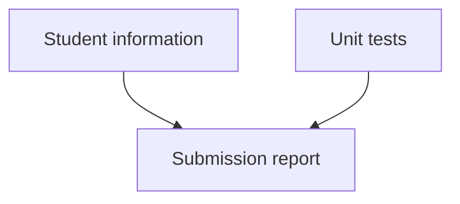

# Submission instructions

**[INFO 5340 / CS 5650](https://www.cs.cornell.edu/courses/cs5650/): Virtual and Augmented Reality**
Cornell Tech

## Student information
Your Unity project has a folder named *Submission* inside the *Asset* folder. This is where you must enter your submission details in the `Student Information.asset` file, by selecting it in the Unity editor and filling out the text forms in the inspector.

## Unit tests

Some homework assignments are partially graded through unit tests. See the assignment rubric for each assignment for information on its weight. You must run **all** unit tests before pushing to GitHub, to make sure this data is included in your submission report. If you modify your code without running the unit tests, that code change will not be reflected in your submission report. 

For running unit tests, bring up the Unit Test Tool Window in Rider and then **run all unit tests**. See guidelines and keyboard shortcuts for unit tests in the [Rider documentation](https://www.jetbrains.com/help/rider/Reference_Windows_Unit_Tests.html). You will then see how many tests have failed or passed.

Your expected implementations are clearly marked with `TODO` comments across the project. Your code should go between the `<solution>` ... `</solution>` tags. You should not modify other scripts, or add code outside of the `<solution>` ... `</solution>` tags.

**You should not modify any of the tests or the test results. Tampering with the unit testing process in any way is considered a serious academic integrity issue.**

## Submission report
The submission report is automatically generated every time you push to GitHub. The report (PDF) can be found in the submission folder. The report collects your student information data and your unit test results at the time of the repository push. **This is the file you will submit on Canvas.**

## Assignment repository
Make sure you have your solution committed to the default branch on your auto-generated repo on GitHub. For most assignments, the default branch is either named 'student' or 'main' branch, and will be the only branch after initializing your repository.
A snapshot of your repo will be automatically timestamped on GitHub Classroom at the deadline. Since the process is automatic, any work committed to the repo after the deadline will not be considered for submission.

## Assignment video
Upload your screen recordings to your Cornell Google Drive account. 

**IMPORTANT**: Make sure to set the video privacy settings as viewable/downloadable by other Cornell Google accounts.
If some tasks/features can’t be verified from your submitted videos you may not get points for that task, as the grading is a combination of video review and code verification.
Make sure the videos are of good quality, and clearly feature the task solutions.
Each video should not exceed 100MB in size.
We recommend using h.264 mp4 for screen recordings.

See *Resources* page on Canvas for information on screen recording tools and best practices.

## Score deduction

**IMPORTANT**: Your score will be deducted if your writeup is unsatisfactory (only two sentences, poor grammar etc.), files are missing or incorrectly named, media files of poor quality, links not working etc.

**IMPORTANT**: You are required to commit to git regularly throughout your process, for example after completing each task, as you would do in any software development project. Your score will be deducted if your commit history doesn’t roughly reflect your progress throughout the assignment, i.e. has too few commits.

**IMPORTANT**: Review the academic integrity section in the course syllabus, make sure to follow the guidelines.

## Assistance
If you have any questions, please post them in the corresponding category/channel on the course communication platform.

