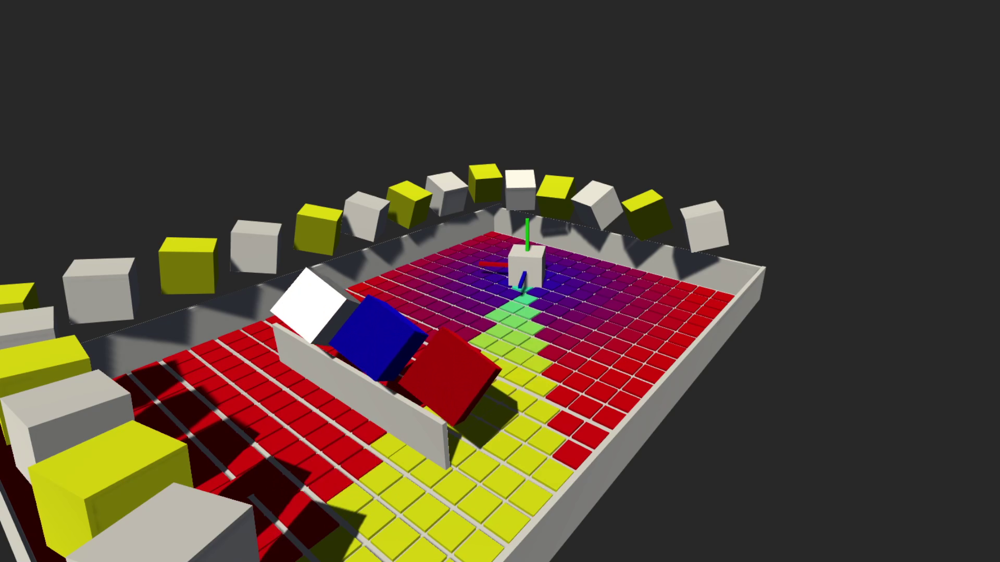
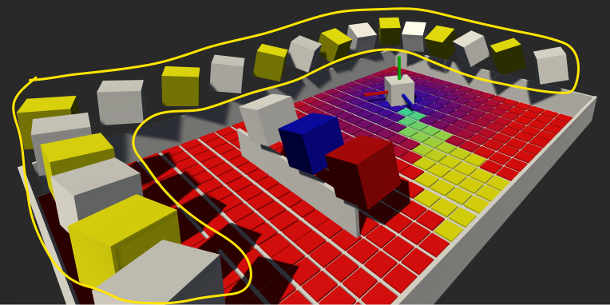
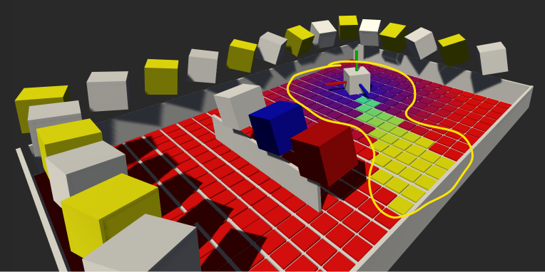
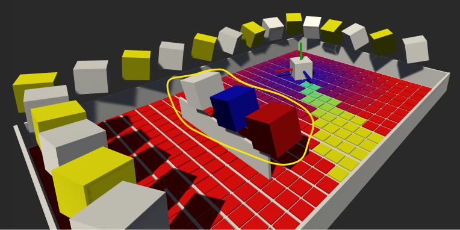

# H-Geometry

**[INFO 5340 / CS 5650](https://www.cs.cornell.edu/courses/cs5650/): Virtual and Augmented Reality** Cornell Tech

---
- Test **[link to another repo](../../xrc/README.md)** test.

**Before you start**
- See Canvas for due date, repository link, and grading rubric. 
- Read the assignment instructions (this document) carefully, from start to finish. 
- Read the **[submission instructions](../submission-instructions/submission-instructions.md)** carefully from start to finish.
- Watch the solution video.
- This assignment assumes basic knowledge of C# and fundamental Unity concepts. See the *Resources* page on Canvas for more information.
- This assignment assumes you have set up the Unity Editor and the development environment as required. See the *Resources* page on Canvas for more information.
- Post your questions in the appropriate channel on the course communication platform.

## Overview

Watch the **[solution video](https://drive.google.com/file/d/1KrwbbetVQqmJpISdWUiwSs6-I_Fk-0bR/view?usp=sharing)** (requires Cornell account).

Your objective is to replicate the full solution seen in the solution video. The player can be moved by using the WASD keys on your computer. Make sure the Game window in Unity is in focus, otherwise the key input might not be detected by Unity.

**Screen recording**: You must move the player, showcasing your implementation clearly, as seen in the solution video. Go three loops around the play area, and rotate the player around when stationary at the end of your recording, as seen in the solution video. When recording your solution, make sure to set your game settings to either *Full HD (1920x1080)* or *16:9 Aspect*.

This assignment focuses on 3D geometry. This topic is covered in lectures and in the course textbook SL, chapter 3. The assignment consists of separate sections, which can be seen completed in the solution video, and described in detail below. Some of the tasks in this assignment involve replicating the behavior of high-level Unity methods by writing your own code using lower-level components, such as Unity's `Matrix4x4`, or writing your own 3D math class entirely - as you will do in the `MyMatrix.cs` and `MyQuaternion.cs` scripts. In addition to the unit tests, you can view the success of your replication by visually comparing it with the regular Unity approach, such as for cubes spinning side-by-side, where the rotation is implemented in a different manner.
    
> ⚠️ Remember that the textbook uses a right-handed coordinate system, while Unity uses a left-handed coordinate system.
        
> ⚠️ You are required to complete your tasks implementing the specific scripts as outlined below for each section.
    
You are not permitted to create new scripts. In this assignment you will only modify specific scripts, located in a folder corresponding to each section. Each script will have a skeleton code and provide you with hints on how to get started.

Your expected implementations are clearly marked with `TODO` comments across the project. Your code should go inside the `<solution>` tags. You should not modify other scripts, or add code outside of the `<solution>` tags. You should also not modify anything in the scene hierarchy, game objects' inspector, or create any new assets. 
    
**Everything is achieved by writing code only.**
    
You find everything related to this assignment in the *xrc-assignments-geometry* folder, in the *Assets* folder in your Unity project. You should not modify any other folders. As mentioned above, you only need to modify the scripts inside the *Scripts* folder.
    
> ⚠️ You don't have to 'Build' this project to test your changes. You can press play to test your changes.
    
> ⚠️ All your tasks are marked with `TODO` comments embedded in the task scripts. You can see a convenient list of those in your project using your IDE. See instructions for JetBrains Rider [here](https://www.jetbrains.com/help/rider/Navigation_and_Search__Navigating_Between_To_do_Items.html).
        
### Textbooks
    
SL : Steve LaValle - [Virtual Reality](http://lavalle.pl/vr/) (2016)

Notation: SL-3 refers to chapter 3, SL (3.35) refers to equation 3.35.
        
### Useful links

- [Matrix4x4](https://docs.unity3d.com/ScriptReference/Matrix4x4.html)  

- [Quaternion](https://docs.unity3d.com/ScriptReference/Quaternion.html)

- [Transform](https://docs.unity3d.com/ScriptReference/Transform.html)
 
 - [Mesh](https://docs.unity3d.com/ScriptReference/Mesh.html)
 
 - [Vector3](https://docs.unity3d.com/ScriptReference/Vector3.html)
    

---

# 1 - Look-at

## Description
    
The expected outcome is to have all the cubes along the play area edge behave in the same way; they should constantly rotate towards ("look at") the player, as shown in the solution video. The starting project already includes the rotation implementation for the gray cubes, using a simple approach via Unity's API. You can see this in the script `SimpleLookat.cs`. This script is completed and should not be modified.
    
Your task is to implement this same behavior for the yellow cubes, **by using Unity's `Matrix4x4` class.** You will implement this in the `MyLookAt.cs`script, which is used by the `MyLookAtRotation.cs` script. This includes getting the vertices, constructing the transformation matrix, and then transforming each vertex, thereby transforming the object. The script includes skeleton code to help you get started, with your tasks marked with `TODO` comments.

> ⚠️ The matrix transformation should not distort the object (cube). If that happens, your matrix contains incorrect values for this particular rotation operation.

> ⚠️ An important consideration is that Unity is left-handed, while the textbook uses a right-handed approach. This means that eq. (3.38) in the textbook needs to be modified with that in mind when implementing in Unity.
    
## Tasks
Your task is to implement a look-at rotation of the yellow cubes towards the player's head using Unity's `Matrix4x4` class.
            
The key to this task is understanding SL-3.2 and the *Starting from a look-at* section in SL-3.4. Even though that section focuses on viewing transformations and camera pose, it gives a useful walkthrough of how to rotate an object towards a target point $p$:
            
1. Position of the eye: $e$ (in our case an *eye* is a yellow cube)
2. Central looking direction of the eye: $\mathbf{c}$
3. Up direction: $\mathbf{u}$
            
where $\mathbf{c}$ is given by
        
$$
\mathbf{c} = \frac{p-e}{\|p-e\|}
$$
            
Both $\mathbf{u}$ and $\mathbf{c}$ are unit vectors.
            
This can  then be used to calculated the column vectors of the rotation matrix
            
$$
\begin{aligned}
    \mathbf{z} &= \mathbf{c} \\
    \mathbf{x} &= \mathbf{u} \times \mathbf{z} \\
    \mathbf{y} &= \mathbf{z} \times \mathbf{x}
    \end{aligned}
$$

Notice how the sign for $\mathbf{c}$ is different compared to SL (3.38). This is due to the textbook using a right-handed coordinate system, while we are working with Unity which uses a left-handed coordinate system.
        
Once you have calculated the vectors, you can set them as the column vectors of your 4x4 matrix. That is, from (3.35) in SL-3.4 we have
            
$$
\begin{aligned}
    R_{eye} &=
    \begin{bmatrix}
        x_1 & y_1 & z_1\\
        x_2 & y_2 & z_2\\
        x_3 & y_3 & z_3\\
    \end{bmatrix}
\end{aligned}
$$
            
which we can use in a 4x4 homogeneous matrix as follows
            
$$
R_{eye_{4x4}} =
\begin{bmatrix}
    x_1 & y_1 & z_1 & 0\\
    x_2 & y_2 & z_2 & 0\\
    x_3 & y_3 & z_3 & 0\\
    0 & 0 & 0 & 1
    \text{\huge}
\end{bmatrix}
$$
            
You will then use this matrix to transform the original vertices.
            
Note that this operation could have been achieved with the original 3x3 matrix but Unity only provides us with 4x4 matrix class. In this task you will have to use that class. You will create your own generic matrix class in another section of this assignment, and use it for creating 3x3 rotation matrices.
            
See SL-3 for more detailed information.
            
## Scripts
    
Short descriptions of relevant scripts. Most scripts also contain useful comments and hints in the skeleton code, with your tasks marked with `TODO` comments. 
    
### `MyLookAt.cs`

Note: You are not allowed to use Unity's `Quaternion` class at all in this task. This means you cannot use certain `Matrix4x4` member methods such as `SetTRS(...)` and static methods such as `Matrix4x4.Rotate(...)`. Instead you must calculate the column vectors and set them in your matrix using the `SetColumn(...)` member method for `Matrix4x4`.

This task requires you to implement the methods in this class, as indicated in the `TODO` comments.

### `MyLookAtRotation.cs`

This script is a attached to each *MyLookAtCube* game object. It references a target transform in the scene, which is the look-at target for the script. In our case this is set as the player.
        
The `Start()` method includes code that initializes the arrays holding the original vertices, as well as the transformed vertices, which are modified each frame in the `Update()` method. The `Update()` method calls the static `LookAt` method, passing along the game object's position, the target object's position, and the game object's original vertices.
      
There are no tasks for you to implement in this script, and it should not be modified. It uses the `MyLookAt` class which you will implement, as described.
    
### `SimpleLookAt.cs`

This script is attached to each gray `SimpleLookAtCube`. It references a target position in the scene, which is the look-at target for the script. In our case this is set as the head of the player.
        
## Learning outcomes
- [ ] Know how to construct a rotation matrix using Unity's `Matrix4x4`
- [ ]  Know when to use Unity's `MultiplyPoint3x4` vs `MultiplyPoint`
- [ ]  Know how to normalize vectors
- [ ]  Know how to use cross products

---

# 2 - Vectors

## Description
    
The expected outcome is to have the color of the floor tiles respond to the players's proximity and orientation as shown in the solution video.
    
The starting project includes skeleton code which you will have to fully implement.
    
Your task is to implement the following two modifications of the floor color.
    
1. Radial color effect based on the players's position, that is, its proximity to a floor tile.
2. Directional color effect based on the player's forward direction.
    - If the player is looking in the direction* of a tile, it should be colored yellow. For this you should use the forward vector of the player's transform, as well as the vector between the tile and the player. Note that you want to eliminate the y-axis from this calculation as the player doesn't look up/down. 
    - You should use dot products for this evaluation, and allow for a range of values to toggle the coloring, so the end result will look as the one shown in the solution video.
    
The floor tiles (prefab) have all been placed in the scene. Your only modification takes place in the script, not in the scene hierarchy.
    
## Tasks
### 1. Radial color effect
        
Implement a color effect visualizing the player's proximity to a floor tile, as shown in the solution video.
        
#### Approach
- Let $d$ be the distance from the floor tile to the player's head.
 - Let $r$ be a distance threshold
 - Let $\alpha$ be the color modifier

$$
\alpha = \max\left(\frac{r-d}{r},0\right)
$$
            
You should then use $\alpha$ to modify the color as follows:
                
$$
\begin{aligned}
R &= 1 - \alpha \\
G &= 0 \\
B &= \alpha 
\end{aligned}
$$
                
In the code, $r$ is already set by the constant `k_DistanceThreshold`.
                            
If all of the above is implemented correctly, the radial color effect will be exactly as shown in the solution video.
            
### 2. Directional color effect
        
Implement a color effect visualizing the player's forward direction, as shown in the solution video.
        
#### Approach
            
Let $p$ represent the position of a floor tile. 
            
- Let $a$ represent the position of the player.          
- Let $\mathbf{v}$ represent the unit vector in the direction from $p$ to $a$, that is $\mathbf{v} = a - p$          
- Let $\mathbf{f}$ represent the forward vector of the player. This can be found using `transform.forward`, which is a unit vector in the forward direction of the object's local coordinate system.

**Note:** You are only interested in the direction in the $xy$ plane (the player's model only rotates around the up axis). So, before calculating the dot product you should modify the y-component of $\mathbf{v}$ to match the y-component of $\mathbf{f}$, which essentially discards the effect of the y-component, resulting in $\mathbf{v}^\prime$.
            
Then the dot product $\mathbf{v}^\prime \cdot \mathbf{f}$ will indicate the collinearity (opposite) of the two vectors. You will evaluate this outcome and modify the tile color based on this value, that is, if the dot product is in a certain range or beyond a certain threshold, then modify the color. This modification should be setting the green channel to 1, and leave other channels unchanged. This will turn that tile yellow (since it was already red), as shown in the solution video.
            
## Scripts
    
### `FloorColor.cs`
        
Attached to the *FloorTile* prefab. This script references a target, calculates the distance, and modifies the color value of its material based on this distance, as well as on the orientation of the player.     

## Learning outcomes
- [ ]  Know how to use dot products
- [ ]  Know how to calculate vector magnitude

---

# 3 - Rotation

## Description
    
The expected outcome is to have the three cubes rotate identically, as shown in the solution video, using three different rotation implementations.
    
In the starter project, the gray cube is already rotating, using Unity's `Quaternion` class, as seen in the `SimpleRotation.cs` script. This script is completed and should not be modified.
    
Your task is to implement the rotation for the other two cubes by **creating your own matrix and quaternion classes**, and using them to rotate the blue and the red cube, respectively.
    
The cubes rotate around the three axis directions, using the same angle $\theta$ for all rotations. 

> ⚠️ **The order of rotation must be as follows**: **first roll, then pitch, and finally yaw**. This is to match the order of Unity's `Quaternion.Euler(...)` which is used to rotate the gray cube. If done correctly, then the blue and red boxes, using `MyMatrix` and `MyQuaternion`, respectively, will rotate exactly as the already implemented rotation for the gray cube.
    
> ⚠️ For this section you are not permitted to use Unity's `Quaternion` or `Matrix4x4` classes, instead you must use your own implementation as described here.
    
> ⚠️ The `AngleGenerator.cs` script on the *SceneController* game object simply provides a continuous angle (in degrees) to be used in the scene. This script is complete and should not be modified.
    
When using the `angle` property of `AngleGenerator` in your scripts, remember to convert to radians where needed.
    
## Tasks
### 1. Custom matrix rotation
        
Rotate the blue cube by implementing your own matrix class `MyMatrix`, which is used to rotate the object's vertices through the `MyMatrixRotation.cs` script, which is attached to blue cube.
        
**Approach**
            
The three standard rotation matrices are given in SL (3.16, 3.17, 3.18). In our case we are using the same angle value $\theta$ in each frame for all rotations:
            
$$
\begin{aligned}
R_{z} &=
\begin{bmatrix}
\cos{\theta} & -\sin{\theta} & 0\\
\sin{\theta} & \cos{\theta}& 0\\
0 & 0 & 1\\
\end{bmatrix}
\end{aligned}
$$
            
$$
\begin{aligned}
R_{x} &=
\begin{bmatrix}
1 & 0 & 0\\
0 & \cos{\theta} & -\sin{\theta} \\
0 & \sin{\theta} & \cos{\theta}\\
\end{bmatrix}
\end{aligned}
$$
            
$$
\begin{aligned}
R_{y} &=
\begin{bmatrix}
\cos{\theta} & 0 & \sin{\theta}\\
0 & 1 & 0\\
-\sin{\theta} & 0 & \cos{\theta}\\
\end{bmatrix}
\end{aligned}
$$
            
where $R_z$, $R_x$, and $R_y$ represent *roll*, *pitch*, and *yaw*, respectively. The angle value is changed between frames, resulting in a continuous rotation.
            
            
> ⚠️ For matching the gray cube's rotation, remember to follow the order of rotation given in *Description.*
                
You will need to multiply the three matrices (in the correct order) and multiply the resulting matrix with each point (vertex), therefore rotating the cube.
            
### 2. Custom quaternion rotation
        
Rotate the red cube by implementing your own quaternion class `MyQuaternion`, which is used to rotate the object's vertices through the `MyQuaternionRotation.cs`, script which is attached to red cube.
        
**Approach**

> ⚠️ Note that the textbook defines quaternions as $q = (a, b, c, d)$ where $a$ is the scalar, and $b,c,d$ the three vector components. This is different from Unity's definition of $q = (x, y, z, w)$ where $x,y,z$ are the vector components and $w$ the scalar. You are not using Unity's `Quaternion` class here, but this is worth keeping in mind.
            
            
Let $(\mathbf{v},\theta)$ be an axis-angle representation of a 3D rotation, then this can be represented by the following quaternion:
            
$$
q = \left( \cos \frac{\theta}{2}, v_1\sin{\frac{\theta}{2}},v_2\sin{\frac{\theta}{2}},v_3\sin{\frac{\theta}{2}} \right)
$$
            
You will have to implement this conversion in the `AngleAxis(float angle, Vector3 axis)` method in the `MyQuaternion` class.
            
For any two quaternions, $q_1$ and $q_2$, let $q_3 = q_1 * q_2$ denote the product, which is defined as
            
$$
\begin{aligned}
a_3 = a_1 a_2 - b_1 b_2 - c_1 c_2 - d_1 d_2 \\
b_3 = a_1 b_2 + a_2 b_1 + c_1 d_2 - c_2 d_1 \\
c_3 = a_1 c_2 + a_2 c_1 + b_2 d_1 - b_1 d_2 \\
d_3 = a_1 d_2 + a_2 d_1 + b_1 c_2 - b_2 c_1
\end{aligned}
$$
            
You will use this to implement the `*` operator overloading in your `MyQuaternion` class.
            
Once you have set all three quaternions, you will multiply them to get the final quaternion. You will use that quaternion to rotate the vertices of the object by applying quaternion multiplication as

$$
p^\prime = q * p * q^{-1}
$$

where $p$ is the point in quaternion format, and $q^{-1}$ is the inverse quaternion. You will have to implement the static `Inverse(...)` method in `MyQuaternion` which returns the inverse of a quaternion.
            
## Scripts

### `MyMatrix.cs`        

This is your custom matrix class. You will only implement a fraction of the usual methods for a matrix class. You will implement an operator overloading for `*` for matrix multiplication. You also have to implement the static helper method that returns a yaw, pitch, or roll matrix when given an angle and the rotation type. You don't have to implement matrix addition etc. as it's not required for this simple task.
        
The script includes skeleton code to help  you get started.
        
### `MyMatrixRotation.cs`
        
This script is attached to the game object to be rotated. You should instantiate three `MyMatrix` rotation matrices using the static `GetRotationMatrix(float radAngle, RotationType type)` method. You then have to multiply these in the correct order and apply the resulting matrix to rotate the vertices of the object.
        
### `MyQuaternion.cs`
        
This is your custom quaternion class. Similar to the custom matrix class, you will implement multiplication, and also the inverse, as well as the conversion from angle-axis representation to quaternion. 
        
### `MyQuaternionRotation.cs`
        
This script is attached to the game object to be rotated. The values of the three quaternions, yaw, roll, and pitch, need to be calculated in the `Update()` method using the `AngleAxis(...)` method. This and other steps required in this script are outlined in the `TODO` comments in the script.
        
### Learning outcomes
- [ ]  Know how to implement a matrix class
- [ ]  Know how to implement a quaternion class

---

# Good luck

Remember to follow the submission instructions.
