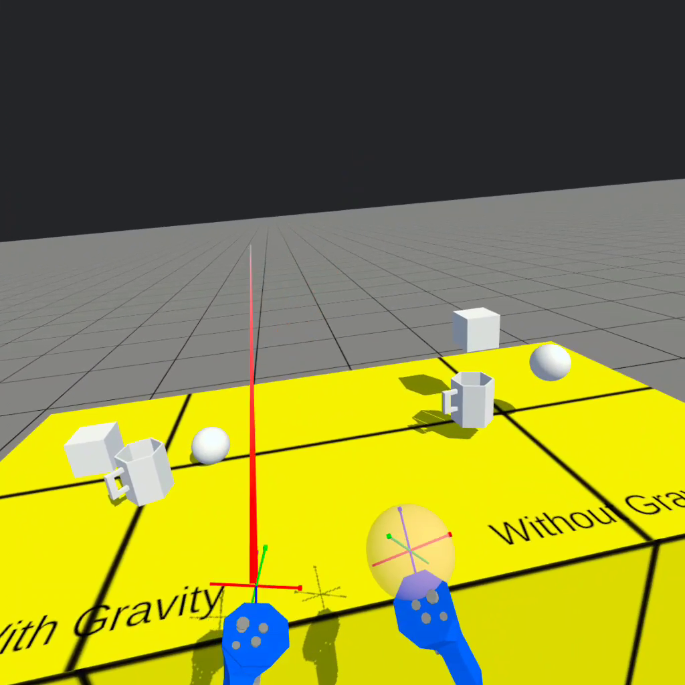
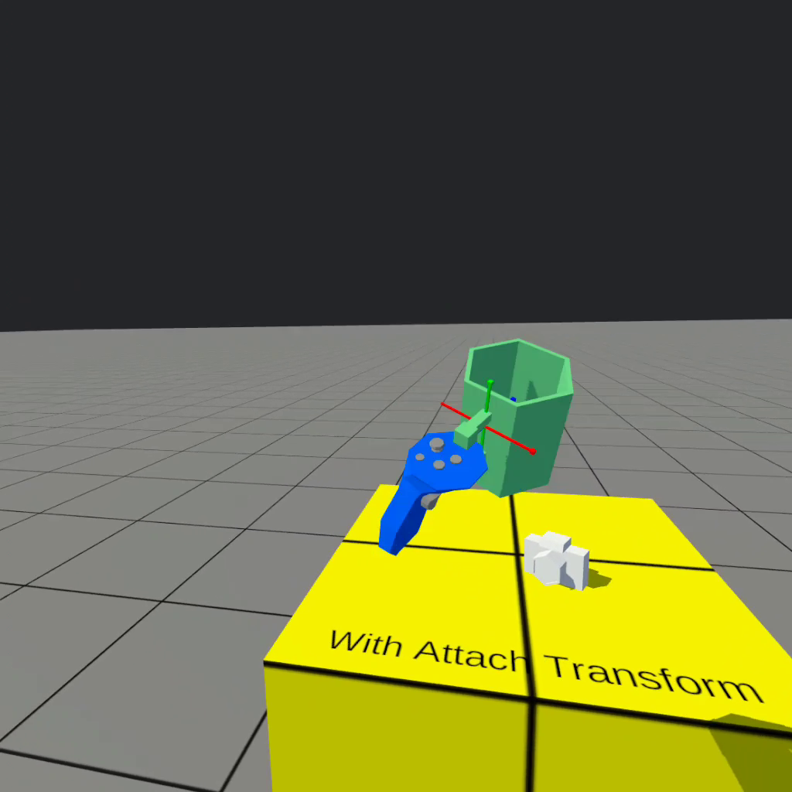
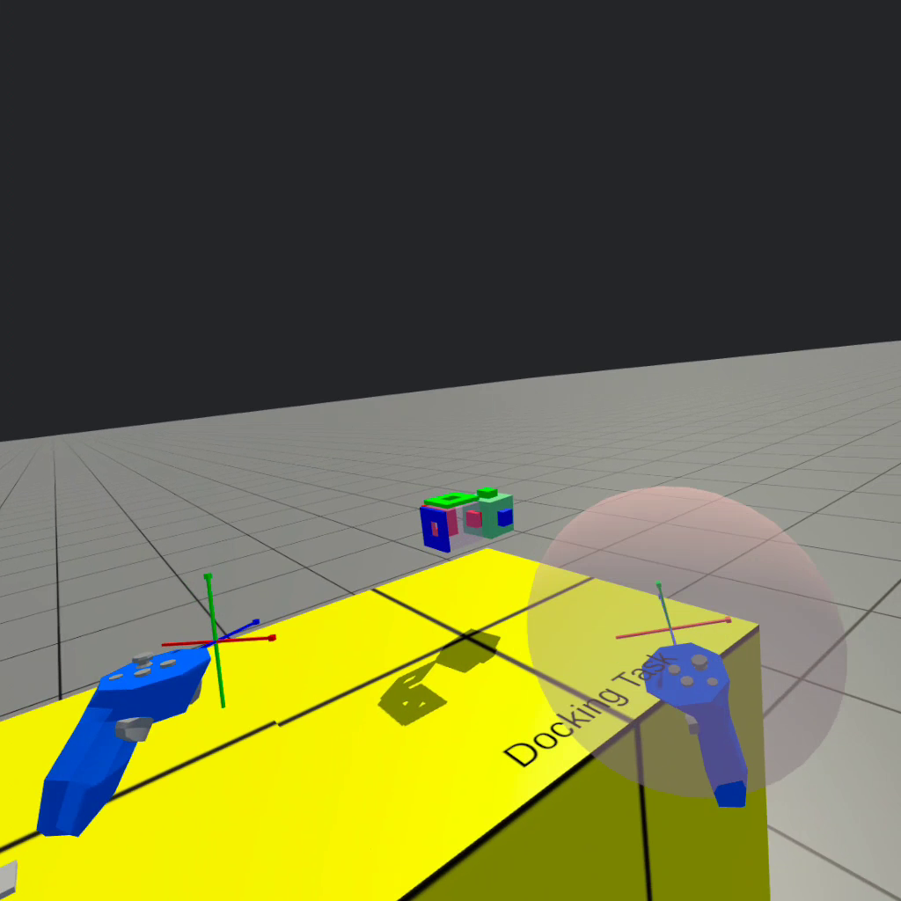

# H-Interaction
 
**[INFO 5340 / CS 5650](https://www.cs.cornell.edu/courses/cs5650/): Virtual and Augmented Reality**, Cornell Tech

---

**Before you start**
- See Canvas for due date, repository link, and grading rubric. 
- Read the assignment instructions (this document) carefully, from start to finish. 
- Read the **[submission instructions](../submission-instructions/submission-instructions.md)** carefully from start to finish.
- Watch the solution video.
- This assignment assumes basic knowledge of C# and fundamental Unity concepts. See the *Resources* page on Canvas for more information.
- This assignment assumes you have set up the Unity Editor and Meta Quest headset and the development environment as required. See the *Resources* page on Canvas for more information.
- Post your questions in the appropriate channel on the course communication platform. 

## Overview

Watch the **[solution video](https://drive.google.com/file/d/1ylFT1NtMYhPq-bNONL7INAdsuLJag_ND/view?usp=share_link)** (requires Cornell account).

> Note: The solution video contains audio commentary, make sure to have audio turned on.

> Note: Your solution video should **not** include audio and should be shorter than the video above.

Your objective is to replicate the full interaction system seen in the solution video.

**Project APK**: You will need to build your final solution to the Meta Quest, and submit the .apk file. Please refer to the Quest [building instructions](https://developer.oculus.com/documentation/unity/unity-build/) for details on how to build your project.

> ⚠️ Building the project to the Meta Quest takes time and could potentially raise unexpected issues! Please test build your project as soon as possible, and build it frequently as you progresses to make building-related debugging easier. **Please leave enough time in the end for the final build**.

> **You must submit your final APK by providing a link to the APK file** on your Google Drive - make sure the file is accessible by all Cornell accounts. This link is provided in the same way as your GitHub repository and screen recording.

> ⚠️ **You must make the following updates in your project before building your final APK** 
>
> Under `Edit > Project Settings > Player` replace "yourlastname" and "yournetid" in the following places:
>
> * Update the "Product Name" by inserting your information
> * Update the "Package Name" by inserting your information

**Screen recording**: Use the screen recording feature of the Meta Quest to capture your screen, see instructions [here](https://www.meta.com/help/quest/articles/in-vr-experiences/social-features-and-sharing/record-video-oculus/).

This interaction assignment helps you understand how to grab, manipulate, and release virtual objects through codes. You will calculate and update the transform hierarchy for the interactable object such that it can be grabbed and released. You will implement the script to change the size of the near-spherical interactor to allow more controlled interaction. You will also implement the far-ray interactor to be able to control the position and rotation of the grabbed object remotely. Finally, you will complete the docking task to learn how virtual placement can be made easier than that of the reality through snapping objects to target poses.

> Note: When you record your solution video, make sure to be standing (not sitting down) while wearing the headset to ensure the best viewpoint.

You are not permitted to create new scripts. In this assignment you will only modify specific scripts, which will have a skeleton code and provide you with hints on how to get started.

Your expected implementations are clearly marked with `TODO` comments across the project. Your code should go inside the `<solution>` tags. You should not modify other scripts or add code outside of the `<solution>` tags. 

## Textbooks
    
SL : Steve LaValle - [Virtual Reality](http://lavalle.pl/vr/) (2016), Chapter 10.3 Manipulation

## Documentation

**This assignment provides a [Scripting API](https://xrcollaboratory.github.io/xrc-assignments-interaction/api/XRC.Assignments.Interaction.html)**. You can use this scipting API to familiarize yourself with the project and relevant classes and method. The scripting API is a representation of the code comments found within the scripts.

## Unit testing
> ⚠️ Note: This assignment contains unit tests. Make sure to run all unit tests. See submission instructions for details.

# Scenes
## `Interaction`

This is your solution scene. When building your APK for the Meta Quest, make sure to select only this scene in the *Scenes In Build* section in the *Build Settings* menu. You should not modify anything in the scene hierarchy for the `Interaction` scene, its game objects' inspector, or create any new assets. 

You find everything related to this assignment in the *xrc-assignments-interaction* folder, in the *Assets* folder in your Unity project. You should not modify any other folders. As mentioned above, you only need to modify the scripts inside the *Scripts* folder.

### Scene hierarchy of Interaction

> ⚠️ Note: Please refer to the *Documentation / Scripting API* for conveniently exploring the project documentation.

Locomotion
- Player Rig (This is a hierarchical representation of your avatar in VR. It is similar to the one in Locomotion assignment)
    - Head
        - Main Camera
    - Left Hand
        - Left Hand Aim
            - Far Interactor (The ray-shaped interactor to grab and manipulate objects remotely)
        - Left Hand Base
    - Right Hand
        - Right Hand Aim
            - Near Interactor (The spherical interactor to grab and manipulate objects it encapsulates)
        - Right Hand Base
- Environment (All the scene models and lighting game objects are attached underneath)
    - Directional Light
    - Five tables with objects for five different manipulation tasks
        - Grabbable objects with gravity
        - Grabbable objects without gravity
        - Grabbable objects with attach transform
        - Snap placement
        - Docking task
    

# Tasks

In this assignment, you will work on the core functionalities of interaction in VR, including grabbing and releasing objects, manipulating objects with near and far interactors, and snap placement. There are several `TODO` sections distributed over the scripts. Before you start, please make sure you read through the instruction and have a general understanding of the scene and script hierarchy. 

The empty project can be built and run, and you will see the following results:
- You can see the interactable objects on yellow tables around you, but you are not able to interact with them
- There is a ray interactor attached to your left hand
- There is a sphere interactor attached to your right hand

Some known issues:
- The Oculus Home button for reorientation does not work in the built application. **Please find a large enough space when you interact and record the video.**
- The text on the tables will always render on top of other objects.

> After implementation:
> 
> Your grip buttons can be used to grab and release the objects.
> 
> Your left joystick can move the grabbed object closer or further away along the ray direction. It can also rotate the grabbed object around its up vector.
>
> Your right joystick can scale the sphere interactor up or down to change the range it can interact with.

## 1 - Grabbing and Releasing

`GrabInteractable.cs` handles grabbing and releasing. `Grab(...)` allows you to grab objects on the *With Gravity* and *Without Gravity* tables. `GrabAttachTransform(...)` allows you to grab objects on the *With Attach Transfrom* table to your left. `ReleaseResetParent(...)` allows you to release any grabbed item.

**Attach Transform** is used in VR interaction when you want the grabbable object to automatically snap to the hand in a preset orientation. The attach transform will be aligned with the transform of the hand. This is often desirable when grabbing tool-like objects, such as camera, cup, hammer etc.

**Gravity** in Unity needs both a collider and a `Rigidbody` component. To enable gravity, you need to check `Use Gravity` and uncheck `Is Kinematic` fields. (You do not need to do this in this assignment. We have updated the settings for you.)

## 2 - Near Interactor

`NearInteractor.cs` allows you to adjust the size of the sphere interactor with the right joystick. You will implement the `NearSphereScale(...)` method.

## 3 - Far Interactor

`FarInteractor.cs` handles far manipulation using the ray. `FarManipulationMove(...)` allows you to move a grabbed object closer and away from you with the left joystick. `FarManipulationRotate(...)` allows you to turn the grabbed object around its up vector with the left joystick.

## 4 - Docking tasks

`DockingController.cs` handles the snap placement and docking task. `IsUnderDistanceThreshold(...)` allows the object to be snaped to the target position when it is close enough to the target. It is used the snap placement task. `IsUnderRotationThreshold(...)` also checks for the proximity of rotation. The two methods are both used in the docking task.

## Good Luck

- Test and build your project as soon as possible.

- Reach out for help if you get stuck.

- Remember to follow the submission instructions. 
