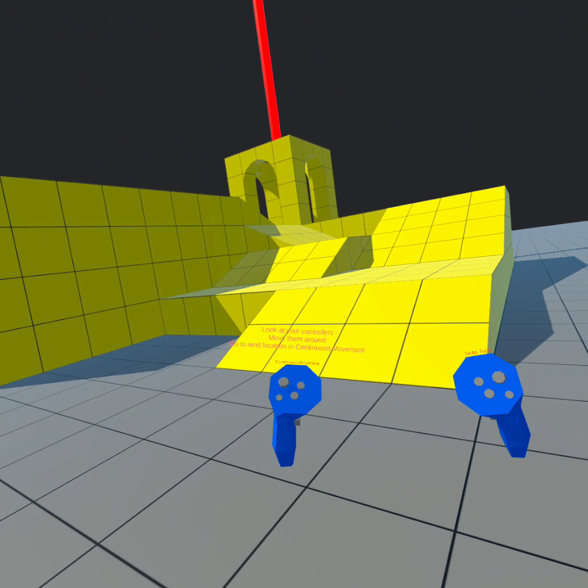
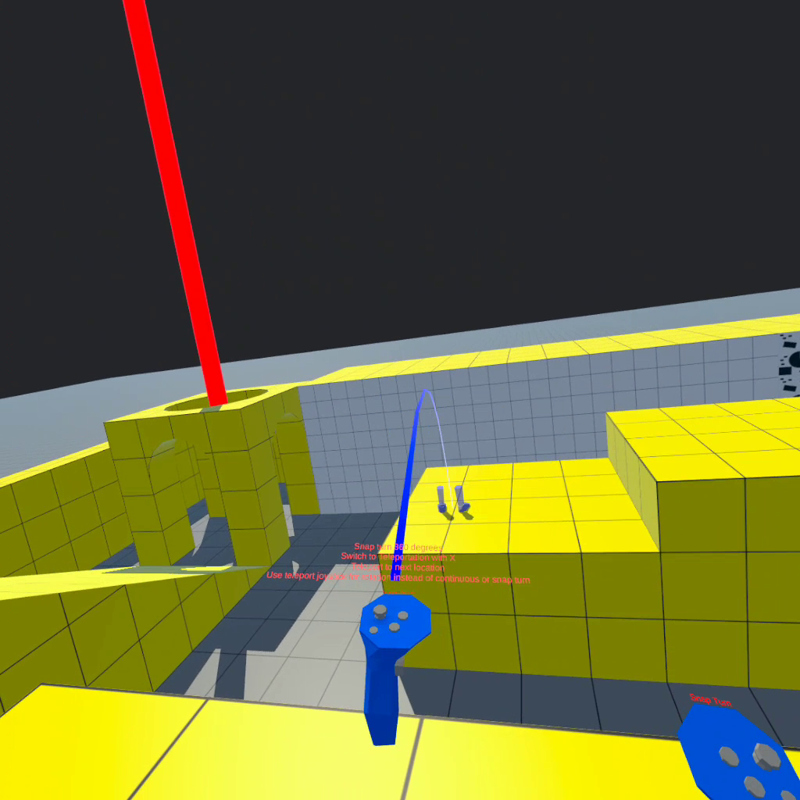
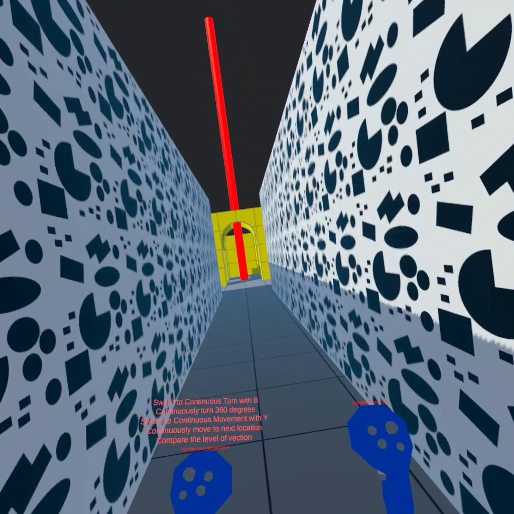

# H-Locomotion

**[INFO 5340 / CS 5650](https://www.cs.cornell.edu/courses/cs5650/): Virtual and Augmented Reality**, Cornell Tech

---

**Before you start**
- See Canvas for due date, repository link, and grading rubric. 
- Read the assignment instructions (this document) carefully, from start to finish. 
- Read the **[submission instructions](../submission-instructions/submission-instructions.md)** carefully from start to finish.
- Watch the solution video.
- This assignment assumes basic knowledge of C# and fundamental Unity concepts. See the *Resources* page on Canvas for more information.
- This assignment assumes you have set up the Unity Editor and Meta Quest headset and the development environment as required. See the *Resources* page on Canvas for more information.
- Post your questions in the appropriate channel on the course communication platform. 

## Overview

Watch the **[solution video](https://drive.google.com/file/d/1q_t9Aee3dxBB-b_Me6nRJGp4qQeOhEY8/view?usp=sharing)** (requires Cornell account).

> Note: The solution video contains audio commentary, make sure to have audio turned on.

> Note: Your solution video should **not** include audio and should be shorter than the video above.

Your objective is to replicate the full locomotion system seen in the solution video.

**Project APK**: You will need to build your final solution to the Meta Quest, and submit the .apk file. Please refer to the Quest [building instructions](https://developer.oculus.com/documentation/unity/unity-build/) for details on how to build your project. **Your APK file should go in *Assets/Builds* folder.**

> ⚠️ Building the project to the Meta Quest takes time and could potentially raise unexpected issues! Please test build your project as soon as possible, and build it frequently as you progresses to make building-related debugging easier. **Please leave enough time in the end for the final build**.

> **You must submit your final APK by providing a link to the APK file** stored on your Google Drive - make sure the file is accessible by all Cornell accounts. This link is provided in the same way as your GitHub repository and screen recording.

> **You must make the following updates in your project before building your final APK** 
>
> Under `Edit > Project Settings > Player` replace "yourlastname" and "yournetid" in the following places:
>
> * Update the "Product Name" by inserting your information
> * Update the "Package Name" by inserting your information

**Screen recording**: Use the screen recording feature of the Meta Quest to capture your screen, see instructions [here](https://www.meta.com/help/quest/articles/in-vr-experiences/social-features-and-sharing/record-video-oculus/).

This locomotion assignment helps you understand how tracking works and how to turn input values read from player controllers into movements and rotations to navigate the player through a virtual environment. You will learn how different locomotion techniques work, including Continuous Movement, Teleportation, Continuous Turn, and Snap Turn. This topic is closely related to textbook SL-10.2. 

You are not permitted to create new scripts. In this assignment you will only modify specific scripts, which will have a skeleton code and provide you with hints on how to get started.

Your expected implementations are clearly marked with `TODO` comments across the project. Your code should go inside the `<solution>` tags. You should not modify other scripts or add code outside of the `<solution>` tags. 

## Textbooks
    
SL : Steve LaValle - [Virtual Reality](http://lavalle.pl/vr/) (2016), Chapter 10.2 Locomotion

## Documentation

**This assignment provides a [Scripting API](https://xrcollaboratory.github.io/xrc-assignments-locomotion/api/XRC.Assignments.Locomotion.html)**. You can use this scipting API to familiarize yourself with the project and relevant classes and method. The scripting API is a representation of the code comments found within the scripts.

## Unit testing
### Note: This assignment contains unit tests. Make sure to run all unit tests. See submission instructions for details.

# Scenes
## `Locomotion`

This is your solution scene. When building your APK for the Meta Quest, make sure to select only this scene in the *Scenes In Build* section in the *Build Settings* menu. You should not modify anything in the scene hierarchy for the `Locomotion` scene, its game objects' inspector, or create any new assets. 

You find everything related to this assignment in the *xrc-assignments-locomotion* folder, in the *Assets* folder in your Unity project. You should not modify any other folders. As mentioned above, you only need to modify the scripts inside the *Scripts* folder.

### Scene hierarchy of Locomotion

It is important to understand the scene hierarchy of Locomotion because you will eventually create a full VR scene on yourselves in your group project and for your future work.

> ⚠️ Note: Please refer to the *Documentation / Scripting API* for conveniently exploring the project documentation.

Locomotion
- Player Rig (This is a hierarchical representation of your avatar in VR)
    - Head
        - Main Camera
    - Left Hand
        - Left Hand Aim (Located at the tip of your controller, oriented towards the pointing direction)
        - Left Hand Base (The Center of your hand)
    - Right Hand
        - Right Hand Aim (same as above, for right hand)
        - Right Hand Base (same as above, for right hand)
- Environment (All the scene models and lighting game objects are attached underneath)
- TrackingHands (A representation of your controllers, designed specifically for the tracking task - see below. You will not need this in your own implementation)
- Locomotion Manager
    - This game object handles all locomotion tasks
    - Five Scripts are attached to it
        - *LocomotionManager* (Handles the inputs and supports technique switching with buttons)
        - *ContinuousMovementController* and *TeleportationController* (Handle movements)
        - *ContinuousTurnController* and *SnapTurnController* (Handle rotations)
- Locomotion Visualizer
    - This game object handles the visualization of locomotion, including the ray and indicator for teleportation and the active technique name texts that are displayed on your controllers. 

# Tasks

In this assignment, you will work on the core functionalities of position tracking, continuous movement, continuous and snap turn, and teleportation. There are several `TODO` sections distributed in multiple scripts. Before you start, please make sure you read through the instruction and have a general understanding of the scene hierarchy and the script hierarchy. 

> Please refer to textbook SL-10.2 for more information on locomotion theory.

The empty project can be built and run, and you will see the following results:
- Your controllers are transparent because the actual model is not correctly tracked yet. 
- Continuous movement would teleport you to the center of the scene (next to the ramp)
- Teleportation ray and indicator can be displayed. But the indicator orientation is fixed.
- Continuous and snap turn and teleportation would teleport you to the center and tilt your view

> Your left joystick controls your movement in VR. 
> 
> Your right joystick controls your rotation in VR. 
>
> Button X, Y toggle between Continuous Movement and Teleportation. 
>
> Button A, B toggle between Continuous and Snap Turn. 
> 
> The currently active technique is written at the tip of your controller. 

## 1 - Tracking

Finish the `TrackedWorldTransform(Matrix4x4 tTrack, Matrix4x4 tCart)` method in `TrackingInput.cs` based on the method documentation. After implemented, the actual model of your controllers in VR will overlap with the default transparent controller, and they will follow your hand movements. 

## 2 - Continuous Movement

Finish the `MovedPosition(Vector3 startingPosition, Vector3 direction, float speed, float deltaTime)` method in `ContinuousMovementController.cs` based on the method documentation. After implemented, the Continuous Movement technique will be working, and you can smoothly move around the VR scene with the left controller under Continuous Movement mode. 

## 3 - Rotation

Finish the `RotatedTransform(Matrix4x4 startingTransform, Vector3 centerPosition, Vector3 axis, float angleDegrees)` method in `LocomotionBase.cs` based on the method documentation. This method calculates the result transform after rotation, which is shared by `ContinuousTurnController.cs`, `SnapTurnCrontroller.cs` and `TeleportationController.cs`. All three classes extend from the class `LocomotionBase`. 

After implemented, the Continuous and Snap Turn techniques will both be working. Teleportation won't fully work with this method alone.

## 4 - Teleportation

Finish the `GetTeleportedPosition(Vector3 targetPosition, Vector3 startingRigPosition, Vector3 startingCameraPosition)` method and `GetFacingDirection(Vector3 handPointingDirection, Vector2 inputVector)` method in `TeleportationController.cs` based on the methods documentation. With `GetFacingDirection` alone, you will be able to change the facing direction of the green teleportation indicator with your left joystick. With `GetTeleportedPosition` and the Rotation step working, you will be able to teleport around the scene without changing orientation.

After the Rotation step and both methods are implemented, the Teleportation will be fully working. You can teleport and control the teleported orientation with your left joystick.

## Good Luck

- Test build your project as soon as possible.

- Reach out for help if you get stuck.

- Remember to follow the submission instructions. 
