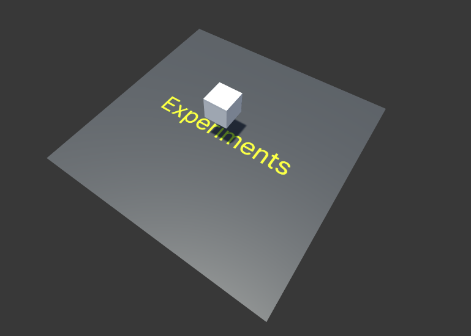

# H-Meshes

**[INFO 5340 / CS 5650](https://www.cs.cornell.edu/courses/cs5650/): Virtual and Augmented Reality**

---

**Before you start**
- See Canvas for due date, repository link, and grading rubric. 
- Read the assignment instructions (this document) carefully, from start to finish. 
- Read the **[submission instructions](../submission-instructions/submission-instructions.md)** carefully from start to finish.
- Watch the solution video.
- This assignment assumes basic knowledge of C# and fundamental Unity concepts. See the *Resources* page on Canvas for more information.
- This assignment assumes you have set up the Unity Editor and the development environment as required. See the *Resources* page on Canvas for more information.
- Post your questions in the appropriate channel on the course communication platform.

## Overview

Watch the **[solution video](https://drive.google.com/file/d/1uxtplqZLlvTTZzb9X8pjdCRNk3oZq-cD/view?usp=sharing)** (requires Cornell account).

Screenshot of the solution:

Screenshot of the initial scene:

Your objective is to replicate the full solution seen in the solution video. 

> **Note**: There are no unit tests for this assignment. Please refer to the Canvas rubric for details on grading.

**Screen recording**: When recording your solution, **make sure to set your game settings to *Full HD (1920x1080)***. Please refer to submission instructions for more details on screen recordings.

This assignment focuses on 3D meshes and related concepts, such as vertices, triangles, and normals. This topic is related to content found in chapters SL-3 and SL-7 in the course textbook. 
    
You are not permitted to create new scripts. In this assignment you will only modify specific scripts, which will have a skeleton code and provide you with hints on how to get started.

Your expected implementations are clearly marked with `TODO` comments across the project. Your code should go inside the `<solution>` tags. You should not modify other scripts or add code outside of the `<solution>` tags. 

# Scenes
## `Meshes`

This is your solution scene. You should not modify anything in the scene hierarchy for the `Meshes` scene, its game objects' inspector, or create any new assets. 

## `Experiments`

There is a seperate scene, named `Experiments`, where you can test your implementetations and tweak inspector values for the `MeshModifier` script. Once you have verified your solution in the experiments scene, the `Meshes` scene should play exactly as in the solution video.

    
**Everything is achieved by writing code only.**
    
You find everything related to this assignment in the *xrc-assignments-meshes* folder, in the *Assets* folder in your Unity project. You should not modify any other folders. As mentioned above, you only need to modify the scripts inside the *Scripts* folder.

    
> ⚠️ You don't have to 'Build' this project to test your changes. You can press play to test your changes.
    
> ⚠️ All your tasks are marked with `TODO` comments embedded in the task scripts. You can see a convenient list of those in your project using your IDE. See instructions for JetBrains Rider [here](https://www.jetbrains.com/help/rider/Navigation_and_Search__Navigating_Between_To_do_Items.html).
        
### Textbooks
    
SL : Steve LaValle - [Virtual Reality](http://lavalle.pl/vr/) (2016)

Notation: SL-3 refers to chapter 3, SL (3.35) refers to equation 3.35.
        
### Useful Unity references

- [Matrix4x4](https://docs.unity3d.com/ScriptReference/Matrix4x4.html)  
 
 - [Mesh](https://docs.unity3d.com/ScriptReference/Mesh.html)
 
 - [LineRenderer](https://docs.unity3d.com/ScriptReference/LineRenderer.html)
    

---

As you see in the solution video, there is a range of mesh manipulations to be performed - of increasing complexity.

The `Meshes` scene is already populated with game objects containing all the meshes. Each of these game objects has a component which performs a manipulation on its mesh. This component consists of the `MeshModifier.cs` script. You should look through this script to understand the flow of the overall project, but you should not modify it in any way. You should also not modify any of the inspector values for the game objects in `Meshes` scene.

# Scripts

**You will only modify the scripts listed below.** You will find `TODO` comments in each of these files, along with `<solution>` tags, indicating where your code should go. Make sure to read carefully the `///summary` comments related to the `TODO` comments, which describe each method in detail, including its input parameters and return values, if applicable.

## `MyMeshUtil.cs`

This is the utility class that peforms the mesh modifications. There are several `TODOS` listed for you to implement.

### Modification region
A subset of vertices can be selected based on their position in the mesh's local coordinate system. For example, the code enables the selection of only the vertices in the top half of mesh, and then modification can be applied to only these vertices, leaving other vertices unchanged.

It is your task to implement the `SelectVertices(...)` method which takes a mesh and the indicated region of interest as input, and returns an array of indices representing the selected vertices.

### Modification type
The following mesh modifications need to be implemented in `MyMeshUtil.cs`, see the relevant `TODO` and `///summary` comments in code for additional descriptions:
* *Transform*
* *Translate*
* *Rotate*
* *Scale*
* *Translate in Normal Direction*

These modifications take place through identically named methods in `MyMeshUtil.cs`. As you see in the script, `Translate(...)`, `Rotate(...)`, and `Scale(...)` simply pass on parameters to `Transform(...)`. Your task is to implement the `Transform(...)` method to transform the selected vertices using the input parameters.
* You should use `Matrix4x4` class and its methods to achieve this.

### Oscillation
Each modification has the option to enable *oscillation* mode, this means that the modifications input parameter swings between $-p$ and $p$ if the input parameter is represented by $p$.

## `TriangleVisualizer.cs`

This is a component that can be added on to any game object that contains a `MeshFilter`, such as all Unity basic shapes; cube, sphere, cylinder and so on. The component will visualize each triangle in the mesh by drawing a line between vertices for each triangle. This is achieved by using a `LineRenderer` component. Specifically, the script creates a child game object for each triangle containing a line renderer.

# Good luck

Remember to follow the submission instructions.