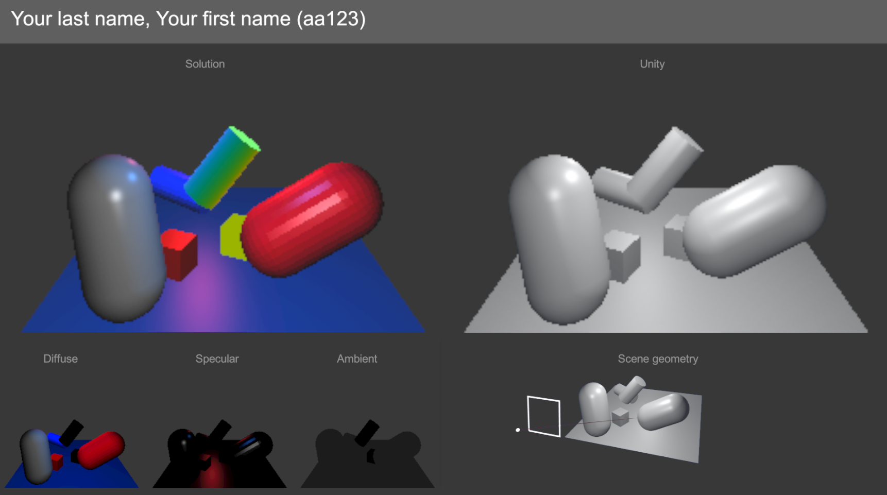
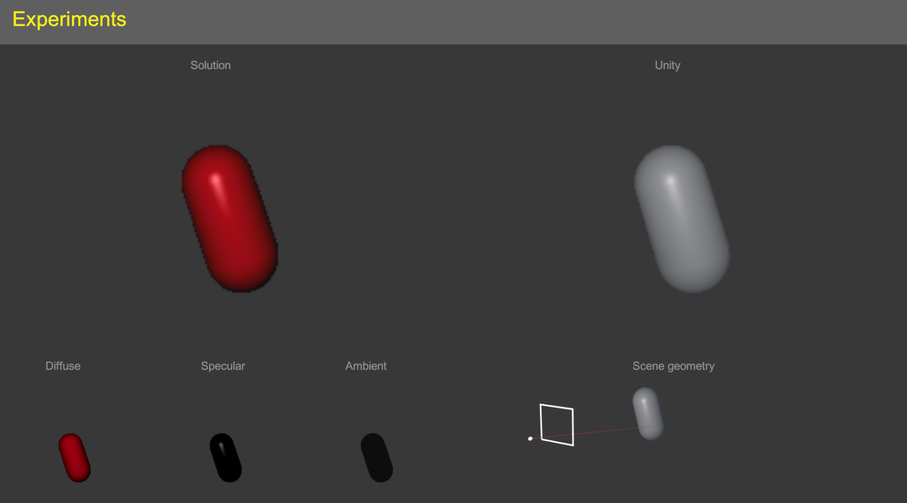
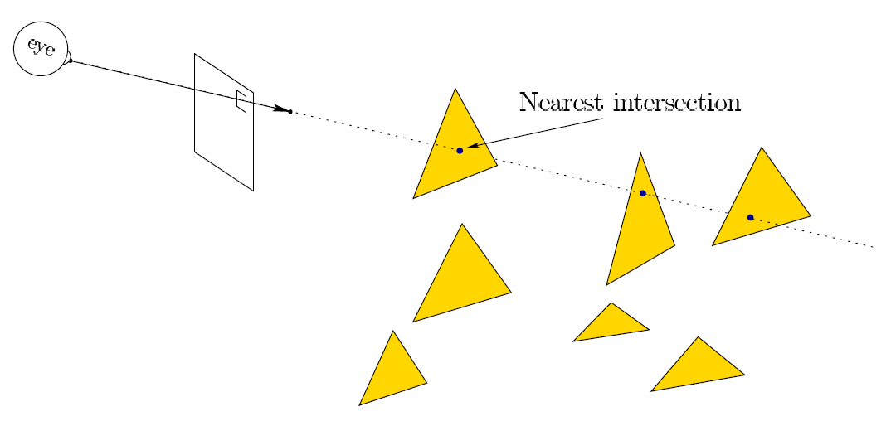
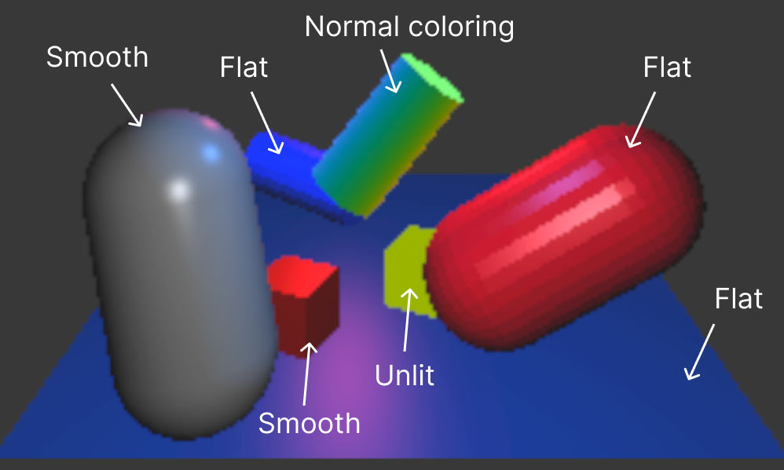
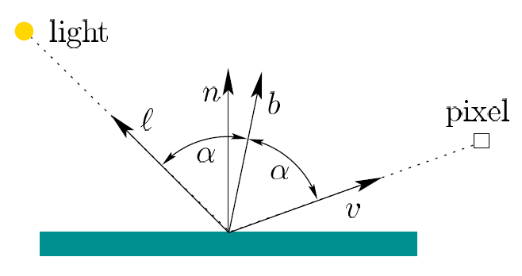
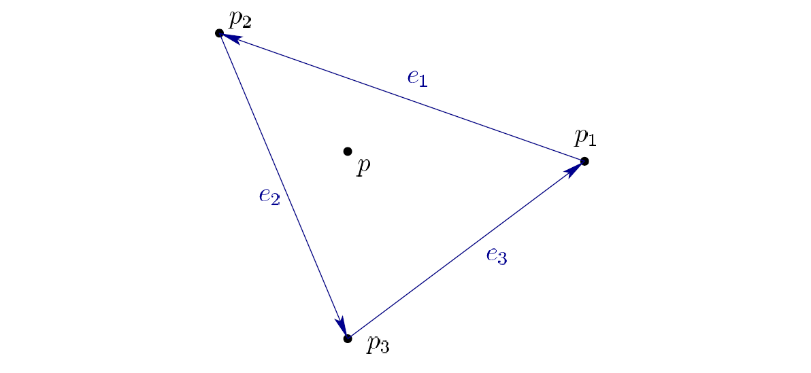

# H-Rendering

**[INFO 5340 / CS 5650](https://www.cs.cornell.edu/courses/cs5650/): Virtual and Augmented Reality**,
Cornell Tech

---

**Before you start**
- See Canvas for due date, repository link, and grading rubric. 
- Read the assignment instructions (this document) carefully, from start to finish. 
- Read the **[submission instructions](../submission-instructions/submission-instructions.md)** carefully from start to finish.
- Watch the videos provided in this document.
- This assignment assumes basic knowledge of C# and fundamental Unity concepts. See the *Resources* page on Canvas for more information.
- This assignment assumes you have set up the Unity Editor and the development environment as required. See the *Resources* page on Canvas for more information.
- Post your questions in the appropriate channel on the course communication platform.

## Overview

Watch the following videos (requires Cornell account) - make sure to set the video quality to 1080p HD for viewing the different shading types: 
* **[Solution video](https://drive.google.com/file/d/1PV-_EBJiOBZrxFkbS0r4xjowqReNTd66/view?usp=sharing)** 
* **[Explainer video](https://drive.google.com/file/d/1__-6yEZ4UAE0i_Hfuy7WG0JtmSwoWRYf/view?usp=sharing)** (instructor commentary and walkthrough of assignment and development setup).

**Your objective is to replicate the full solution seen in the solution video.**

> **Note**: There are no unit tests for this assignment. Please refer to the Canvas rubric for details on grading.

**Screen recording**: When recording your solution, **make sure to set your game settings to *Full HD (1920x1080)***. 
Make sure to have your game view in *maximized* mode when recording. Please refer to submission instructions for more details on screen recordings.
    
You are not permitted to create new scripts. In this assignment you will only modify specific scripts, which will have a skeleton code and provide you with hints on how to get started.

Your expected implementations are clearly marked with `TODO` comments across the project. Your code should go inside the `<solution>` tags. You should not modify other scripts or add code outside of the `<solution>` tags. 
    
**Everything is achieved by writing code only.**
    
You find everything related to this assignment in the *xrc-assignments-rendering* folder, in the *Assets* folder in your Unity project. You should not modify any other folders. As mentioned above, you only need to modify the scripts inside the *Scripts* folder.

    
> ⚠️ You don't have to 'Build' this project to test your changes. You can press play to test your changes.
    
> ⚠️ All your tasks are marked with `TODO` comments embedded in the task scripts. You can see a convenient list of those in your project using your IDE. See instructions for JetBrains Rider [here](https://www.jetbrains.com/help/rider/Navigation_and_Search__Navigating_Between_To_do_Items.html).

### Textbooks
    
SL : Steve LaValle - [Virtual Reality](http://lavalle.pl/vr/) (2016)

Notation: SL-3 refers to chapter 3, SL (3.35) refers to equation 3.35.
        
### Useful Unity references

- [Ray](https://docs.unity3d.com/ScriptReference/Ray.html)  
 
 - [RaycastHit](https://docs.unity3d.com/ScriptReference/RaycastHit.html)
 
 - [Color](https://docs.unity3d.com/ScriptReference/Color.html)

 The creation of this assignment was inspired by Pete Shirley's [Ray Tracing series](https://raytracing.github.io/). If you are interested in this topic you might want to bookmark these for later reading in your own time.

# Scenes
## `Rendering`

This is your solution scene. You should not modify anything in the scene hierarchy for this scene, its game objects' inspector, or create any new assets. The solution scene is already populated with game objects containing all relevant scripts.

> Note: You might receive a warning that no cameras are 
rendering. You can supress this warning in the game view, see [here](https://docs.unity3d.com/Manual/GameView.html).

**Figure**: The *Rendering* scene your solution scene

## `Experiments`
        
There is a seperate scene, named *Experiments*d, where you can test your implementetations and tweak inspector values for the game objects that are using your implementation. Once you have verified your solution in the experiments scene, the solution scene should play exactly as in the solution video.

**Figure**: The *Experiments* scene is a simplified version of the solution scene, allowing you to test your implementation

# Fundamentals

This assignment focuses on visual rendering, ray tracing, shading, and other related concepts. These topics are covered in chapter SL-7 in the course textbook, primarily SL-7.1 and SL-7.2. **First, make sure to read SL-7.1 and SL-7.2**. 

Your task for this assignment is to complete a simple ray tracer, by implementing the *Blinn-Phong* shading model. You will also implement a few additional shading types, see below for details. A complete solution will have an identical appearance to the one shown in the solution video.

> Note: The ray tracer implementation is a simple one, for educational purposes, and not meant to be computationally efficient. You can expect to have a framerate of 4-7 FPS when running the scene.

From the textbook, on the topic of ray tracing:

> To calculate the RGB values at a pixel, a viewing ray is drawn from the focal point through the center of the pixel on a virtual screen that is placed in the virtual world. 
>
> The process is divided into two phases:
> 1. **Ray casting**, in which the viewing ray is defined and its nearest point of intersection among all triangles in the virtual world is calculated.
> 2. **Shading**, in which the pixel RGB values are calculated based on lighting conditions and material properties at the intersection point.

**Figure**: Ray casting. Credit: LaValle. 

In this assignment, a simple ray casting has already been implemented. You task is to complete the implementation of the *shading* phase.

Start by familiarizing yourself with the code in the project, the better you understand all the scripts, the easier it will be for you to implement your code in the task script.

# Shading types

The ray casting phase provides us with some of the information needed for the shading phase. We do get the normal $n$, but depending on the shading type we might want to recalculate the normal, that is, *map the normal*.

Each object will have a component with a property defining its *shading type*. This is an `enum` named `MyshadingType` with the following values:

* Unlit
* Normal coloring
* Flat 
* Smooth

**Figure**: Shading types assigned to objecst in the solution scene, *Rendering*

The shading for Flat and Smooth uses a Blinn-Phong shading model. More details for each shading type are outlined below. The color values for both the surface and the light are given by the corresponding `MyMaterial` component on the object, and the `MyLight` components on the light game objects in the scene. For more information about the Blinn-Phong model please refer to the textbook.

## `MyShadingType.Unlit`

For this shading type, the pixel color is simply assigned the diffuse material color of the primitive being hit, with light direction, view direction, and normal not taken into account. The pixel value is calculated as follows:
$$
L = d
$$

where $L$ is the pixel color, and $d$ is the diffuse material color. This shading type is already implemented in the project.

## `MyShadingType.NormalColoring`

Similar to the unlit type, this shading does not use view or light directions for calculating the pixel color. It does however use the surface normal:

$$
L = c
$$

where $L$ is the pixel color, and $c$ is a color value calculated using the normal, in the object's local coordinate syste, at the hit location, with each color channel $(r,g,b)$ representing the $(x,y,z)$ components of the normal. The components of the normal vector range from -1 to 1, so you will have to convert this into the color range of $[0,1]$
as shown here for the red channel:

$$
c_r = (n_x + 1) * 0.5
$$

If implemented correctly, the objects using this shading type should appear identical to the ones in the solution video.

## `MyShadingType.Flat`

This shading type uses the *Blinn-Phong* shading model:

$$
L = dI\max(0,n\cdot l)+sI \max(0,n\cdot b)^x + L_a
$$

where $L$ is the pixel color, $d$ is the diffuse material color, $I$ is the light color, $n$ is the surface normal vector, $l$ is the light direction, $s$ is the specular material color, $b$ is the bisector, and $x$ is the Phong exponent. 

The component $dI\max(0,n\cdot l)$ is the **diffuse component**, and $sI \max(0,n\cdot b)^x$ is the **specular component**. You will be asked to calculate these components for each ray at its nearest intersection. Please refer to `///summary` comments and the textbook for more details. 

**Figure**: Geometry for the the Blinn-Phong shading model

## `MyShadingType.Smooth`

This shading type is identical to the flat shading, except that the normal value is modified before being used by the Blinn-Phong model

$$
L = dI\max(0,n_m\cdot l)+sI \max(0,n_m\cdot b)^x + L_a
$$

where $n_m$ is the *mapped normal*. The mapping taking place here is a simple interpolation of the three vertex normals for the triangle primitive being hit, using the associated *barycentric coordinates*. See the textbook for explanation on barycentric coordinates. This normal mapping will create the appearance of a smooth surface across a primitive with different vertex normals, despite the underlying geometry being the same as visualized faitfully using the `MyShadingType.Flat`.

**Figure**: The normal for hit $p$ must be mapped by using the barycentric coordinates to calculate a weighted average of the normals of its vertices $p_1$, $p_2$, and $p_3$.

## Multiple light sources

There are several lights the solution scene and we will add their contribution to the pixel color as follows for the shading types using the Blinn-Phong model:

$$
L = L_a + \sum_{i=1}^{N} dI_i\max(0,n\cdot l_i)+sI_i \max(0,n\cdot b_i)^x
$$

This aggregation is already implemented in the code and will result in a the solution shown in the solution video, if the shading is correctly implemented.

# Scripts

The project comes with custom implementations of camera, material, and light components. Each class is fully documented, please refer to the source code for class and method summaries. By inspecting the solution scene you can see how these scripts and components are being used. The `MyCamera` class uses the `MyCameraUtil` utility class, which is the one you will work to complete. 

**You will only modify the script(s) listed below.** You will find `TODO` comments in each of these files, along with `<solution>` tags, indicating where your code should go. Make sure to read carefully the `///summary` comments related to the `TODO` comments, which describe each method in detail, including its input parameters and return values, if applicable.

## `MyCameraUtil.cs`

This is the utility class that peforms the shading calculations and other related work. There are several `TODOS` listed for you to implement, listed above the relevant methods. Each method has a `summary` tag where you can read about the expected functionality for the method.

All methods are documented; it should be clear based on the `///summary` tags how each method is expected to function based on its input parameters and output values.

* `CalculateNormal()`
* `CalculateDiffuseComponent()`
* and more - see `///summary` comments in code for more detail

## Other completed scripts
The following scripts should not be modified. See `///summary` comments in files for description.
* `MyCamera.cs`
* `MyLight.cs`
* `MyMaterial.cs`
* `MyShadingType.cs`

# Good luck

Remember to follow the submission instructions.

**Make sure to watch the explainer video.**
